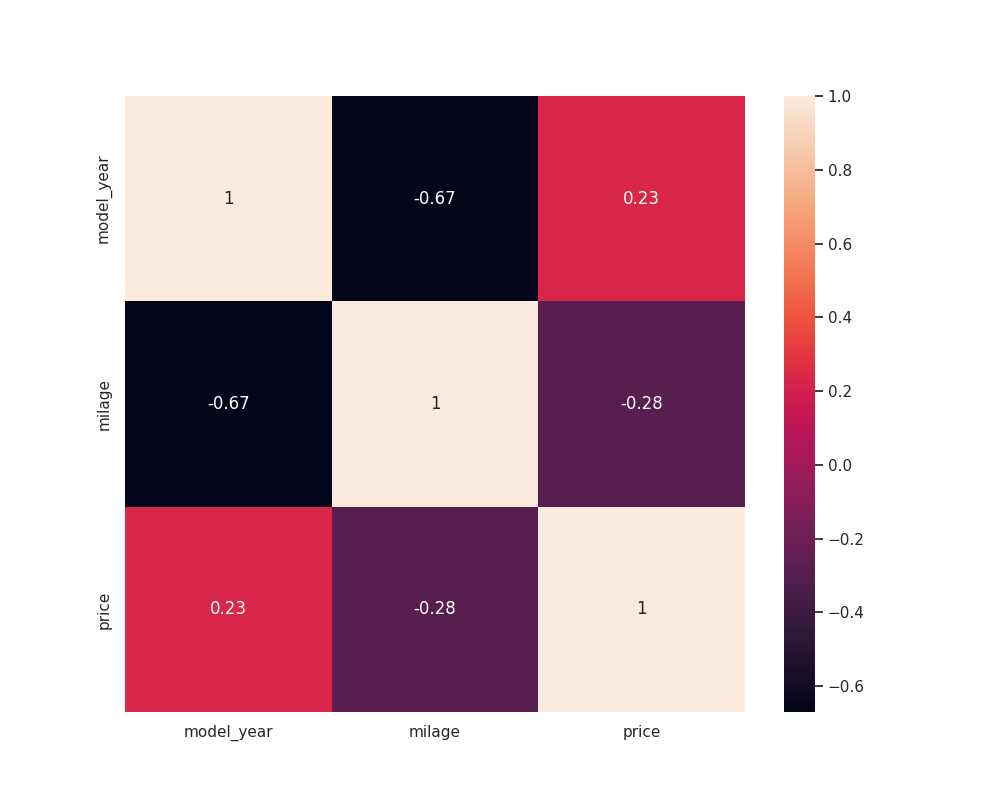

# Regression of Used Car Prices

<b>By Nicole Michaud,</b>

<b>30 September, 2024</b>

The goal of this project is to use various features of used cars to predict the sale price of used cars in unseen data. Different modeling techniques, including multiple linear regression, lasso regression, random forests, and gradient boosting regressor, as well as hyperparameter tuning with GridSearchCV are used to obtain a regression model with a RMSE value that is improved from the RMSE of the baseline (first) model.

## Data Understanding

The training data includes information on 188,533 cars that were made between the years of 1974 and 2024, and the testing data has 125,690 cars from between those same years. Both the training and testing data contain 10 different features about the cars, with the training set differing because it includes the target, 'price'.

## Data Exploration

The necessary packages are imported for the data loading, preprocessing, modeling, and model hyperparameter tuning processes.

The contents and descriptive statistics of the training and testing data are viewed.

Data features containing null values are investigated and handled accordingly.

## Data Preprocessing

The features of numerical data types were displayed on a heat map to see the extent to which they are correlated with the target, 'price', as well as with each other.

While both 'model_year' and 'milage' had a relatively strong correlation with price, 'milage' had a stronger correlation. They were also highly correlated with each other.

Each of the relevant features in the dataset were then explored, to see the unique values they contained and the relationship of those values with the target, using histograms.

The feature 'model_year' ranged from the years 1974 to 2024. For simplicity, this feature was changed to 'model_age' by subtracting each row value from the maximum value (2024).

The feature 'fuel_type' contained a lot of unknown values, but it was found that sometimes the feature 'engine' contained information about the fuel type of the car. This was used to fill in some of the unknown fuel_type values. This was done by combining the 'fuel_type' and 'engine' columns into a new column, cleaning and text processing the column, and then using a function to search through and find the fuel types.

The features 'ext_col' and 'int_col', representing the exterior color and interior color of the cars, respectively, contained a lot of different values for colors. I created a dictionary of the unique values for each and replaced them with the basic word for that color. This effectively reduced the number of categories for these two features.

The feature 'transmission' also contained multiple different terms for the same information (i.e. automatic transmission being represented as 'A/T', 'Automatic', and 'AT'). I used another dictionary to sort all cars into the main transmission types categories. Then, I extracted the information about the number of "speeds" the transmissions had (i.e., '1-Speed', '2-Speed', etc.), and created a new column for this.

The feature 'engine' also contained information about the number of cylinders each car's engine had. This was made into a new column with a function that used regex to search through the column values to see if a number of cylinders was listed.

The feature 'brand' showed that certain car brands have higher prices, on average. Since there were many different brands included in this dataset, I instead grouped them into price categories, based on whether their average price was high (in the top 25%), low (in the bottom 25%), or in the middle.

The feature 'model' contained a lot of unique values, as different brands each have different models. For this project I chose to drop this feature, in an attempt to simplify the data and hopefully prevent model overfitting.

Now that all the features have been pre-processed, the categorical features are then encoded to be numerical. 
The features that had binary categories (only 2 categories) were encoded using OrdinalEncoder. These features included 'clean_title' and 'accident'.

The features with multiple different categories were encoded using LabelEncoder.

Any remaining unnecessary columns were dropped, and a final dataframe to be used in modeling was created.

## Modeling

The independent variables were stored as X, and the dependent variable/target was stored as y.

The data was split into training and testing sets, in order to evaluate the models on before they are used to predict the target values for the test dataframe.

A basic linear regression model was created as the baseline, and had a cross-validated RMSE of about 77213.20.

Next, a lasso regression model was created, with a cross-validated RMSE of 77213.20, which was just about the same as the baseline.

A random forest model was created and had a cross-validated RMSE of 81962.96. This was even worse than the baseline.

Finally, a gradient boosting regression model was created and had a cross-validated RMSE of 75686.49. This was the best performing model yet.

In attempt to further improve the performance of this final model, GridSearchCV was used to search for the optimal combination of model hyperparameters that would result in the best RMSE.

A model was then trained using these optimal hyperparameters, and then used to generate predictions on the test data.

## Conclusion

Of the baseline linear regression model, a lasso regression model, a random forest model, and a gradient boosting regression model, the gradient boosting regression model performed the best, with the lowest RMSE value.
This model was able to be improved even further through hyperparameter tuning with GridSearchCV.
The tuned model was then used to generate predictions for sale price in the test set of used cars with te same features used to train the model.

Next Steps:
- Try other hyperparameters and different values to improve RMSE even more
- Investigate other features of used cars to see their relationship to sale price
- Try out other modeling techniques, to see if any perform even better than the tuned GBM model

